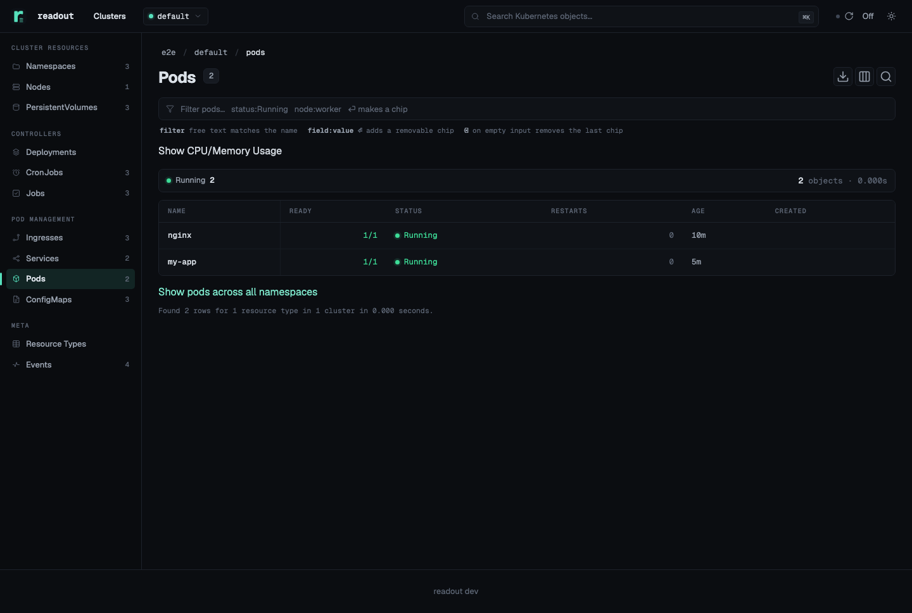
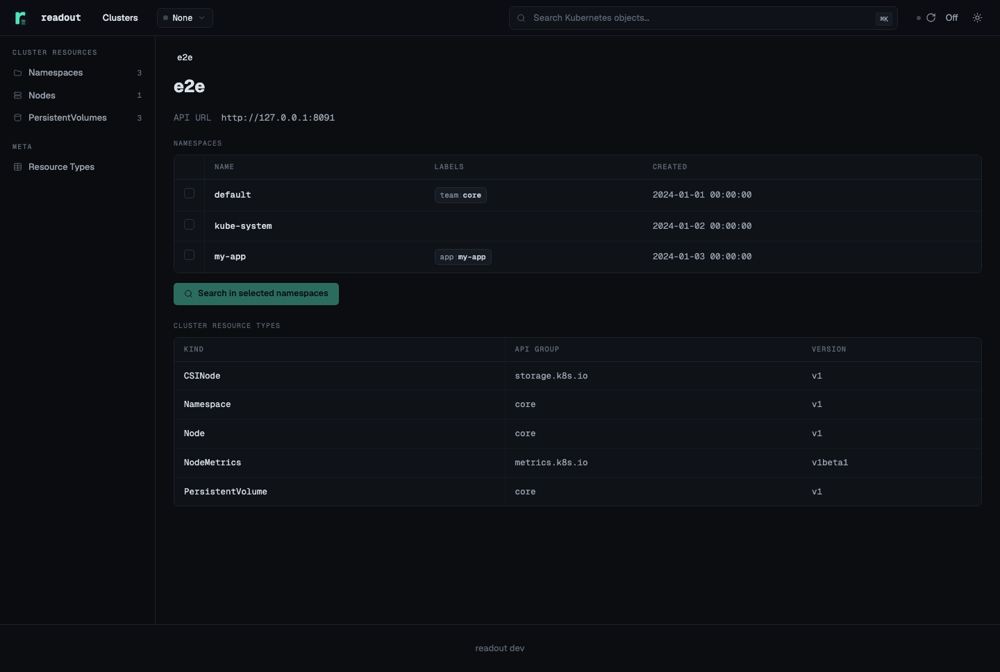
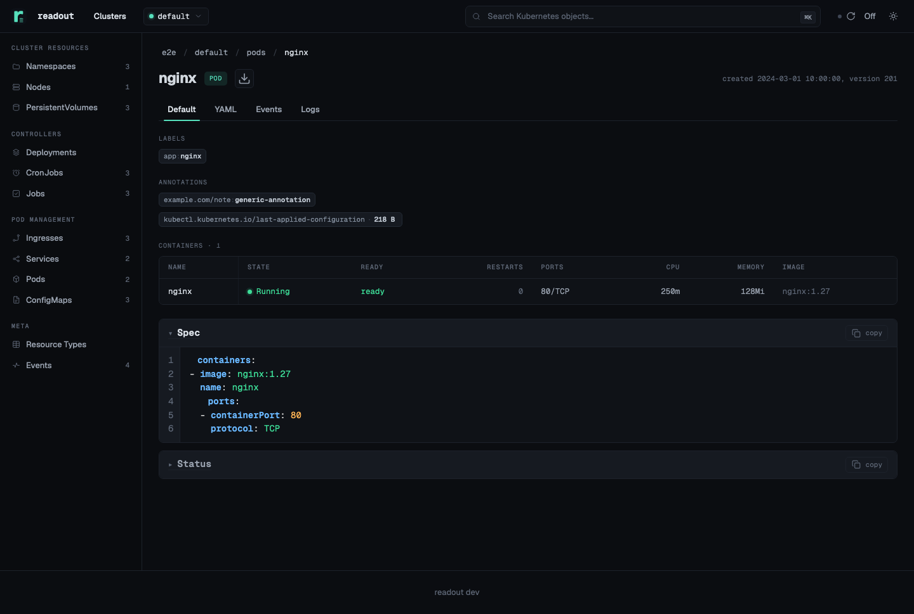
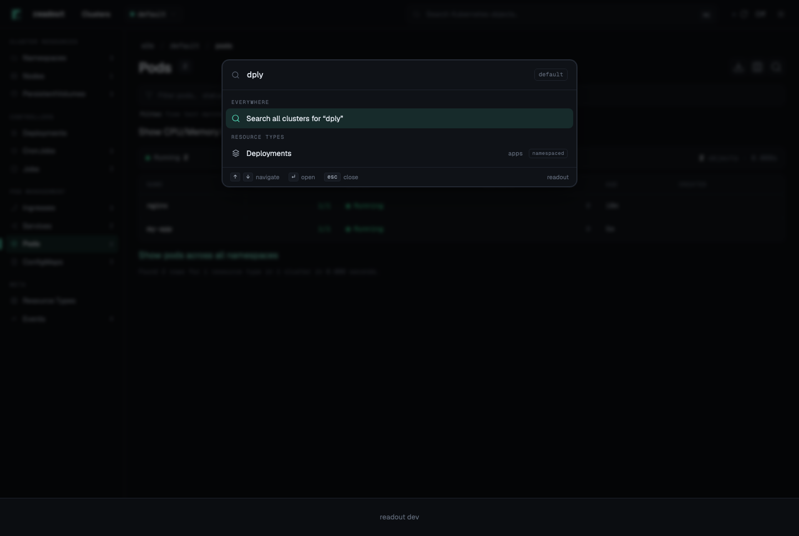

<p align="center">
  
</p>

<h1 align="center">readout</h1>

<p align="center">
  <strong>A read-only window into your Kubernetes runtime.</strong>
</p>

<p align="center">
  See everything, across one cluster or many. Change nothing — by construction.
</p>

<p align="center">
  <a href="LICENSE"></a>
  <a href="https://github.com/kbelokon/readout/releases"></a>
  <a href="https://github.com/kbelokon/readout/pkgs/container/readout"></a>
</p>

<p align="center">
  
</p>

## What is readout?

Kubernetes is where your code actually runs — but seeing what is happening there usually requires cluster access, and cluster access traditionally means the power to change things too. So the people who would most benefit from looking are kept out, and every "what's going on in there?" becomes a ticket to the few who hold the keys.

readout breaks that link. It is a strictly **read-only** web viewer you point at one or more clusters. It cannot write — not "we hid the delete button," but *by construction*: the only verbs it ever uses against a cluster are `get`, `list`, and `watch`. Nothing can be edited, scaled, restarted, or deleted; `Secret` values are hidden by default; and each viewer sees only what their own RBAC allows.

It is not a stripped-down viewer, though. readout shows **every resource type and any CRD** your cluster serves — not a hard-coded list — rendered as clean, legible tables with status, health, and a distinct icon per CRD family, so even an unfamiliar operator's resources are legible. Browse, search, filter, follow logs, and watch it update live — all from one modern web UI.

## Features

- **Any resource, any CRD.** Discovered at runtime and rendered as server-side `meta.k8s.io` Tables (the same columns `kubectl` prints), with a consistent status/health cell vocabulary and an automatic icon + colour for every CRD API group.
- **Drill down to detail.** List → detail → syntax-highlighted YAML → events → container logs, with live log follow, text filtering, and download.
- **Find anything fast.** Search across resource types and a **⌘K command palette** to jump straight to a cluster, resource type, or object.
- **Shape the table.** Filters, sorting, per-column visibility, and **bulk export** of selected objects to YAML or TSV.
- **Live mode.** The view updates itself as the cluster changes (server-sent events) — no manual refresh.
- **Multi-cluster.** Browse one cluster or fan out across many from a single place, including `_all`-cluster and `_all`-namespace views. A cluster that is down or unreachable is shown as such, rather than blanking the page.
- **Pod & node enrichment.** `join=metrics` capacity bars and `join=nodes` enrichment for Pods and Nodes.
- **Built for sharing.** Every view is a URL — paste a link to the exact pod, its YAML, events, or logs into a ticket or chat instead of a screenshot.
- **Comfortable to use.** Dark / light themes, a responsive mobile card layout, and client-side virtualization for very large lists.
- **Fits your stack.** Operator-defined links from objects, labels, and timestamps out to your own dashboards, wikis, and log systems; optional authorization and resource-prerender hooks.

| Multi-cluster overview | Object detail | Command palette (⌘K) |
| --- | --- | --- |
|  |  |  |

## Quick start

readout is a single binary driven by one YAML config. Run it against a config file:

```sh
readout --config readout.yaml
```

That is the whole command line. readout has exactly four flags — everything else about behaviour lives in the YAML config:

| Flag        | Purpose                                              |
| ----------- | ---------------------------------------------------- |
| `--config`  | path to the YAML config file (see below)             |
| `--port`    | TCP listen port (overrides `port:` in the config)    |
| `--debug`   | verbose logging                                      |
| `--version` | print the version and exit                           |

A documented, copy-pasteable example config lives at [`readout.yaml`](readout.yaml) — start from it.

**With Docker** (multi-arch image, amd64 + arm64):

```sh
docker run --rm -p 8080:8080 -v "$PWD/readout.yaml:/readout.yaml" \
  ghcr.io/kbelokon/readout:latest --config /readout.yaml
```

**On Kubernetes**, with the Helm chart (the supported install path):

```sh
helm install readout oci://ghcr.io/kbelokon/charts/readout --version 0.10.1
```

See [`chart/README.md`](chart/README.md) for values, RBAC presets, ingress/Gateway options, and upgrade notes.

### Validating a config offline

```sh
readout config validate --config readout.yaml
```

`config validate` loads the config exactly as startup would — strict parsing, semantic checks, and the same secret/endpoint resolution — then exits `0` and prints `config OK`, or exits `1` with the identical error message startup would print. It performs no cluster or network calls. Because it is faithful to a real startup, the same `READOUT_*` environment variables in your shell affect the result (env values override the file), so validate in the environment the process will actually run in. A bare `readout config`, or an unknown sub-subcommand, prints usage and exits `2`.

## What makes it different

There is no single technical moat here — it is open source, anyone could build it. The difference is the niche readout occupies — one no existing tool fills cleanly — and that it says so plainly.

- **Read-only by construction, not by setting.** This is not "we chose not to show a delete button." The cluster client physically has no mutating method (a regression test fails the build the moment any future `Create*`/`Update*`/`Delete*` appears), the HTTP edge admits only reads, and even the Helm chart's values schema rejects any verb but `get`/`list`/`watch`. Three independent layers — safety you can verify rather than trust, and that cannot quietly regress.
- **Secrets stay hidden, access is scoped by RBAC.** The `Secret` type is dropped by default, and secret values are never serialized anywhere — they are masked even in bulk export. On top of that, per-viewer token passthrough means each person sees exactly what their own RBAC allows.
- **The interface is the main investment, and it shows any CRD.** The UI is clean, modern, and quick to navigate (search, filters, ⌘K). readout knows no fixed list of types — it renders whatever the cluster serves through server-side Kubernetes Tables (the same columns as `kubectl`), and not as bare rows: a consistent visual vocabulary gives status, readiness, capacity bars, and node conditions as cells you can read at a glance, and every CRD gets a meaningful icon by API group and a stable colour — an unfamiliar operator's objects are legible with zero configuration.
- **Many clusters, one pane.** Browse one cluster or many from a single place, without juggling contexts.
- **Everything is a URL.** Each view — a pod, its YAML, its events, its logs — is a link you can share.

What it does have is a focused fit for one job that existing tools do either unsafely, not on the web, or not for everyone — the edge is the combination and the focus. Two more things matter to whoever deploys it: standing it up safely is not a project of its own (safe defaults, and nothing blocks startup — it warns), and it slots into your stack with links out to your own dashboards, wikis, and logs.

## Who is it for

readout is for anyone who needs to see what is running in a cluster but should not — or need not — change it. Normally that visibility is locked behind cluster access, and access carries the power to write, so the choice is to either hand out that power or keep people in the dark. readout removes the choice: it shows everything and changes nothing, so a read-only view can safely go to whoever needs one.

The payoff is a shared point of reference. When everyone works from the same read-only view, they describe what they see the same way — an issue arrives as a link to the exact object, not "something's broken somewhere." It reads the same over a single cluster or a fleet, for one person or a whole org.

## Configuration

Everything that is not a flag is a field in `readout.yaml`, parsed with `sigs.k8s.io/yaml` (the JSON-subset of YAML: standard scalars, lists, and maps; no anchors or merge keys). Unknown keys are rejected, so a typo is caught at startup. The customization surface, all in the YAML:

- **clusters** — statically configured cluster connections using kubeconfig field semantics (`server`, `certificateAuthority`/`certificateAuthorityData`, `tlsServerName`, `token`/`tokenFile`, client cert/key, `impersonate`), and/or kubeconfig discovery (`kubeconfigPath` / `kubeconfigContexts`). See [Connecting to clusters](#connecting-to-clusters) below.
- **columns** — per resource type: `labelColumns` (promote a label to a column), `hiddenColumns` (drop a column), and `customColumns`. Custom columns are **kubectl-style JSONPath** expressions in `NAME:path` form, exactly like `kubectl get -o custom-columns`. A bare path and a braced template are both accepted, e.g. `Image:{.spec.containers[*].image}`. Multi-value results render space-joined.
- **links** — external links rendered next to objects (`objectLinks`, keyed by resource-type plural), label values (`labelLinks`, keyed by label name), and timestamps (`timestampLinks`). Each `href` template expands `{name}`, `{namespace}`, `{value}`, and `{timestamp}` at render time.
- **sidebar** — an **ordered** list of navigation groups; groups render top-to-bottom in the order written, each a heading `label` plus its `resources`. Omit it to use the built-in default layout.
- **preferredApiVersions** — pin a preferred `apiVersion` per resource-type plural when several versions are served.
- **search** — `defaultResourceTypes`, `offeredResourceTypes`, and `maxConcurrency` for multi-resource search.
- **namespaces** — `includeNamespaces` / `excludeNamespaces` RE2 regular expressions (exclude wins; empty include means all; cluster-scoped objects are never namespace-excluded).
- **listenAddress** — bind host for **both** the app and metrics listeners (the port stays per-listener). Empty binds all interfaces (`:port`). **Safe default:** when `listenAddress` is empty **and** `auth.mode` is `none`, readout binds loopback (`127.0.0.1`) so a no-auth instance is not reachable off-host; an explicit value always wins. Binding a network address under `auth.mode: none` logs a loud startup warning (the loaded clusters and auth mode are named) but **never** refuses to start — there are no blocking startup gates. While bound to loopback under no-auth, request `Host` headers must be a loopback name (`localhost` / `127.0.0.1` / `[::1]`), a DNS-rebinding guard that never blocks your own local access.
- **headers auth** — `auth.mode: headers` trusts the identity headers (`auth.trustedHeaders.user` / `email` / `groups`). By default any client that can reach readout directly can set `X-Forwarded-User` and impersonate any user, so headers mode logs a loud startup warning until you constrain it. Set `auth.trustedHeaders.trustedProxyCidrs` to your stripping proxy's CIDR(s): header identity is then honored only when the **TCP peer** (the real connection address — never a forwarded header like `X-Forwarded-For`) falls inside one of the CIDRs, and a peer outside the range (or one that does not resolve to an IP) is rejected. Leaving it empty keeps the trust-all behavior plus the warning; it is **never** a startup error. The groups header is bounded (group count and total length) so an oversized header cannot fan out.

See [`readout.yaml`](readout.yaml) for the full annotated schema, including auth (`none` / `headers` / `oidc`), theming, external readout cross-links, and the external JSON HTTP hooks.

### External auth proxy (headers mode)

Headers mode **is** the external-OAuth deployment: you run an authenticating proxy (oauth2-proxy, an SSO gateway, an ingress auth filter) in front of readout, and the proxy asserts the viewer's identity in `X-Forwarded-User` / `-Email` / `-Groups`. Two requirements make that safe:

- **The proxy MUST strip any incoming `X-Forwarded-User` / `-Email` / `-Groups`** from the client request before setting its own. Otherwise a client can forge identity headers that the proxy passes through untouched.
- **Set `auth.trustedHeaders.trustedProxyCidrs` to the proxy's source range** so readout honors identity headers only from the proxy's TCP peer. Pick the CIDR by topology:
  - **Sidecar in the same pod** (proxy and readout share the pod network): loopback — `127.0.0.1/32` and `::1/128`.
  - **Separate in-cluster proxy / ingress controller**: the proxy's pod CIDR (the range its pods get from the cluster CNI).
  - **External proxy** (off-cluster gateway): the proxy's egress source-IP range.

The peer match is on the real TCP connection address, never a forwarded header, so an attacker cannot spoof it with `X-Forwarded-For`.

Headers mode forwards no bearer token to the apiserver, so combining it with `clusterAuthUseSessionToken: true` (per-viewer passthrough) only works if the proxy **also** forwards a Kubernetes-usable bearer token for the viewer; otherwise strict passthrough denies every request (see [Viewer identity](#viewer-identity-token-passthrough)).

### Authorization hook

`hooks.authorizationUrl` points at an external JSON endpoint consulted on every gated request (and at OAuth callback). It is **fail-closed**: a configured hook must answer `{"allowed": true}` to admit the request. A missing or `false` `allowed` field, a malformed response, or any call error **denies** access — a buggy or compromised hook cannot fail open. The hook may also return `user`, `email`, and `groups` to refine the identity. Hook failures surface a generic message to the browser; the underlying status/body is logged server-side only.

- **URL validation (at load).** The hook URL must be `https`. Plain `http` is accepted **only** for a loopback dev target (`localhost`, `127.0.0.1`, `::1`), and a link-local / cloud-metadata host (e.g. `169.254.169.254`) is rejected. A bad URL is a config-parse error. (This is intentionally stricter than the cluster `server:` URL, which may be a private IP.)
- **Token minimization.** By default the hook receives only identity claims plus `token_type`/`expiry` metadata — **never** the access, id, or refresh tokens. Opt specific tokens in with `hooks.authorizationIncludeTokens`, a list drawn from `access`, `id`, `refresh`. Only the listed tokens are sent; an unknown value is a config error.

### Connecting to clusters

A cluster connection is built from kubeconfig field semantics and handed to client-go, so readout produces TLS and auth exactly the way `kubectl` does — nothing is hand-rolled. There are two sources, which may be combined:

- **Static** — entries under `clusters:`, each a per-cluster block with kubeconfig field names that map 1:1 onto a kubeconfig cluster + user:
  - **Endpoint & TLS** — `server`; CA trust via `certificateAuthority` (PEM file) or `certificateAuthorityData` (inline, base64); `tlsServerName` to override the verified hostname when `server` is an IP or differs from the cert SAN; `insecureSkipTlsVerify` to skip verification (avoid in production — pin the CA instead).
  - **Auth** — an inline `token`, or a `tokenFile` that client-go re-reads on rotation (prefer `tokenFile` for anything that rotates; an inline `token` shadows the file and disables refresh), or client-certificate mTLS via `clientCertificate`/`clientKey` (PEM files) or `clientCertificateData`/`clientKeyData` (inline, base64).
  - **Identity** — `impersonate: {user, groups, uid}` sets a static act-as identity for that cluster's base connection.
  - Cluster names must be unique; a duplicate name is a startup error.
- **kubeconfig** — `kubeconfigPath` (empty uses the usual kubeconfig resolution) and `kubeconfigContexts` (narrow to named contexts; empty = all). The common multi-cluster deployment — a CI/Vault-rendered multi-context kubeconfig mounted from a Secret and pointed at via `kubeconfigPath` — is a worked Helm example in [`chart/examples/kubeconfig-multicluster.yaml`](chart/examples/kubeconfig-multicluster.yaml).

readout can also discover clusters from **Argo CD cluster Secrets** — see the `argoCD:` block in [`readout.yaml`](readout.yaml) and [`chart/examples/argocd-cluster-secrets.yaml`](chart/examples/argocd-cluster-secrets.yaml).

#### Viewer identity (token passthrough)

By default a connection is used as configured (its static token / cert / `impersonate`). Set `clusterAuthUseSessionToken: true` to instead forward the **viewer's own** session token to the apiserver per request, so every request is evaluated under the viewer's RBAC. Passthrough takes precedence for that request: the connection's static token **and** `impersonate` are dropped, so a passthrough request is always evaluated as the viewer, never as the static act-as identity.

With passthrough on, a request that carries **no** forwardable viewer bearer token is **denied**, never silently served under the connection's base identity (an in-cluster SA, a token file, or a static credential). This keeps a deployment that looks like it enforces per-viewer RBAC from quietly falling back to the broad base SA. readout warns loudly at startup when passthrough is on and any base connection carries a real credential, naming the clusters whose bearer-less viewers will be denied. (Headers auth mode forwards no bearer, so every request is denied under passthrough — intended; the same startup warning fires.)

#### `exec` credential plugins (binary prerequisite)

An `exec`-style credential plugin (the kubeconfig `users[].user.exec` mechanism used by `aws eks get-token`, `gke-gcloud-auth-plugin`, `kubelogin`, etc.) is a supported auth field on a connection, but **readout's image does not bundle these plugin binaries** — same posture as Headlamp, whose image ships only `ca-certificates`. The connection is configured for you; the plugin binary is the operator's prerequisite and must be present on `PATH` in readout's runtime image, or the cluster fails at connect time.

An exec credential plugin is an **RCE-equivalent trust boundary**: a kubeconfig or Argo cluster-Secret `exec` command runs an arbitrary binary inside readout's pod, with readout's filesystem, env, and service-account token in reach. Whoever controls a connection's `exec` block controls code execution in the pod. Because of that, readout gates **which** command a connection may run, so a cluster actor who can inject an `execProviderConfig` (most plausibly through an Argo CD cluster Secret, which a cluster actor can create) cannot run an arbitrary binary. The gate applies to every connection source. When `kube.credentialPluginPolicy` is unset (the default), the policy is **source-aware**:

- operator-owned sources (`kubeconfig`, static `clusters:`) default to an allowlist pre-seeded with the common cloud plugins — `aws`, `aws-iam-authenticator`, `gke-gcloud-auth-plugin`, `kubelogin`, `kubectl-oidc_login` — so EKS/GKE-exec kubeconfig installs keep working;
- the discovered **Argo cluster-Secret** source defaults to `DenyAll`, because a cluster actor can create those Secrets.

A denied plugin is **rejected** — the connection becomes a broken cluster — never silently stripped to an anonymous connection. Override uniformly across all sources by setting `kube.credentialPluginPolicy` to `DenyAll`, `Allowlist`, or `AllowAll`; extend the allowlist with `kube.credentialPluginAllowlist` (an entry is matched by command basename, or by exact full path when it contains a `/`). See [`readout.yaml`](readout.yaml) for the block.

### Secrets (environment only)

Secrets are never written to the config file — they come from the environment, and the environment **overrides** the file:

| Variable                              | Purpose                          |
| ------------------------------------- | -------------------------------- |
| `READOUT_SESSION_SECRET`              | signing key for session cookies  |
| `READOUT_OIDC_CLIENT_ID`              | OIDC client id                   |
| `READOUT_OIDC_CLIENT_SECRET`          | OIDC client secret               |
| `READOUT_OIDC_ISSUER_URL`             | OIDC issuer URL                  |
| `READOUT_OIDC_REDIRECT_URL`           | OIDC redirect URL                |
| `READOUT_AUTHORIZATION_HOOK_URL`      | authorization hook URL           |
| `READOUT_RESOURCE_PRERENDER_HOOK_URL` | resource-prerender hook URL      |

The session secret can also be read from a mounted file via the top-level `sessionSecretFile:` config key (the env var wins when both are set). For OIDC the sealed cookie **is** the session (there is no server-side store), so a short or absent secret is forgeable: readout logs a loud startup warning when the OIDC session secret is missing or decodes to fewer than 32 bytes (it accepts base64/hex or a raw string). This is a minimum-length signal, not an entropy check, and it never blocks startup — generate a strong secret with `openssl rand -base64 32`. For OIDC, set the top-level `publicUrl:` (origin only, e.g. `https://readout.example`) to pin the externally-visible origin; readout then derives the OIDC callback as `publicUrl` + `/oauth2/callback`, so an explicit `auth.oidc.redirectUrl` is not required. Leaving `auth.mode` at `none` while OIDC fields are set is a startup error — set `auth.mode: oidc`. See [`readout.yaml`](readout.yaml) for both keys.

## Endpoints

- read-only HTTP edge; the only state-changing route is the allowlisted `POST /preferences` (theme preference);
- resource list / detail / YAML / events / search / container-logs / download routes, plus `_all` cluster and `_all` namespace fan-out;
- `join=metrics` and `join=nodes` enrichment for Pods and Nodes;
- the `Secret` type is dropped by default and re-admitted (with masked values) only when explicitly included;
- `/health`, `/healthz`, `/readyz`, and Prometheus `/metrics`.

## Metrics

Prometheus metrics exposed at `/metrics`:

| Metric                                  | Type      | Meaning                              |
| --------------------------------------- | --------- | ------------------------------------ |
| `readout_http_requests_total`           | counter   | HTTP requests served                 |
| `readout_http_request_duration_seconds` | histogram | HTTP request latency                 |
| `readout_up`                            | gauge     | process liveness (1 while serving)   |

When `metricsPort` is set, `/metrics` moves to its own listener and is disabled on the main port; otherwise it is served on the main port.

## Install & build

[Quick start](#quick-start) covers running readout as a binary, a Docker image, and a Helm release. This section covers the rest.

### Raw manifests

If you want raw manifests instead of a Helm release — to commit them to git, pipe them into another tool, or just read them — render the chart locally:

```sh
helm template readout oci://ghcr.io/kbelokon/charts/readout --version 0.10.1 > readout-manifests.yaml
```

readout deploys on its own host (its own domain or subdomain); it builds root-absolute URLs everywhere and does not support being served under a subpath. The chart's `image.tag` / `appVersion` track the app release they target; the chart's own version moves independently.

### From source

```sh
go build ./cmd/readout
# or:
go install github.com/kbelokon/readout/cmd/readout@latest
```

## License & attribution

readout is licensed under the **GNU GPL-3.0** ([`LICENSE`](LICENSE)). It began inspired by [kube-web-view](https://codeberg.org/hjacobs/kube-web-view) by Henning Jacobs and is a derivative work that honors its copyleft; upstream and bundled third-party attribution is in [`NOTICE`](NOTICE).
